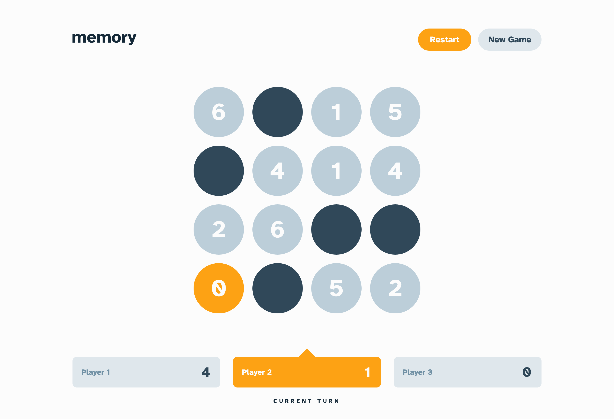

# Memory game solution

This is a solution to the [Memory game challenge on Frontend Mentor](https://www.frontendmentor.io/challenges/memory-game-vse4WFPvM).

## Links

- Solution URL: [Link](https://example.com)
- Live Site URL: [Live Demo](https://memory-game-fem-ionstici.vercel.app/)

## Features

- Play the Memory Game either solo or multiplayer (up to 4 players)
- Set the theme to use numbers or icons within the tiles + custom shape
- Choose to play on either a 6x6 or 4x4 grid
- View your previous game results (data stored in localStorage)

## Screenshot



## Build with

- [React](https://react.dev/) - JS library
- Scss for writing CSS
- [Animista](https://animista.net/) for animations

## What I learned

By using just one property `aspect-ratio', we can keep the shape of the box as square when scaling down the screen.

```css
.container {
  width: 100%;
  aspect-ratio: 1 / 1;
}
```

Note that for this to work for Safari, the `width` property is also needed.

## Author

- GitHub - [Ion Stici](https://github.com/ionStici)
- Frontend Mentor - [@ionStici](https://www.frontendmentor.io/profile/ionStici)
