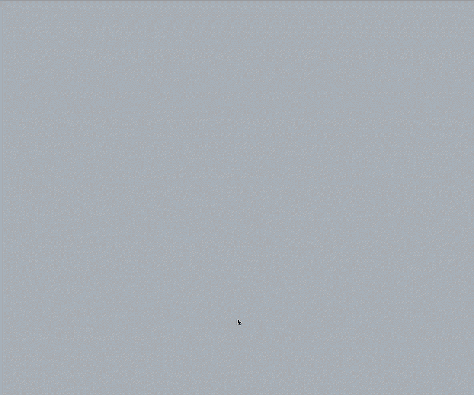

# Memory game solution

This is a solution to the [Memory game challenge on Frontend Mentor](https://www.frontendmentor.io/challenges/memory-game-vse4WFPvM).

| [Live Demo](https://ionstici.dev/memory-game-fem/) | [Demo with Scores](https://memory-game-fem-ionstici.vercel.app/) | [Solution on Frontend Mentor](https://www.frontendmentor.io/solutions/memory-game-54_cK32nNw) |
| :------------------------------------------------: | :--------------------------------------------------------------: | :-------------------------------------------------------------------------------------------: |

Memory Game is a classic memory matching game built with React, Sass, and Vite. The game provides a fun and interactive way to test and improve your memory skills. This project allows users to select different themes, the number of players, grid sizes, and tile shapes.



## Features

- **Theme Selection:** Choose between numbers and icons as the theme for the game.
- **Player Selection:** Play alone or with up to four players.
- **Grid Size Options:** Select between a 4x4 or 6x6 grid for different levels of difficulty.
- **Tile Shape Selection:** Choose between circular or squircle tile shapes.
- **Interactive Gameplay:** Track your time and number of moves as you play.
- **Responsive Design:** The game is designed to be responsive and works well on various devices.
- **Player Names:** Give custom player names by clicking on player score boxes

## Technologies Used

- **React:** A JavaScript library for building user interfaces.
- **Sass:** A preprocessor scripting language that is interpreted or compiled into CSS.
- **Vite:** A build tool that aims to provide a faster and leaner development experience for modern web projects.

## Setup

```bash
# 1. Clone the repository
git clone https://github.com/ionStici/memory-game-fem

# 2. Navigate to the project directory
cd memory-game-fem

# 3. Install dependencies
npm install

# 4. Start the development server
npm run dev
```

## Usage

1. **Start the Game:**

   - Select your desired theme (Numbers or Icons).
   - Choose the number of players (1 to 4).
   - Select the grid size (4x4 or 6x6).
   - Pick the tile shape (Circle or Squircle).
   - Click on "Start Game" to begin.

2. **Gameplay:**

   - Click on tiles to reveal the hidden numbers or icons.
   - Match pairs of identical tiles to remove them from the board.
   - The game tracks the time taken and the number of moves made.

3. **Restart or Start a New Game:**
   - Click "Restart" to restart the current game.
   - Click "New Game" to go back to the setup screen and select new preferences.

## Game Rules

- The goal is to match all pairs of tiles with the same number or icon.
- The game ends when all pairs have been matched.
- Try to complete the game in the least amount of time and moves possible.

## What I learned

By using just one property `aspect-ratio`, we can keep the shape of the box as square when scaling down the screen.

```css
.container {
  width: 100%;
  aspect-ratio: 1 / 1;
}
```

Note that for this to work for Safari, the `width` property is also needed.

## Contributing

Contributions are welcome! If you have any ideas, suggestions, or bug reports, please open an issue or submit a pull request.

## License

This project is licensed under the MIT License. See [LICENSE](./LICENSE) file for more information.

## Contact

- LinkedIn - [in/ionstici](https://www.linkedin.com/in/ionstici/)
- Frontend Mentor - [@ionStici](https://www.frontendmentor.io/profile/ionStici)

Enjoy playing the Memory Game! If you have any questions or feedback, feel free to to reach out.
